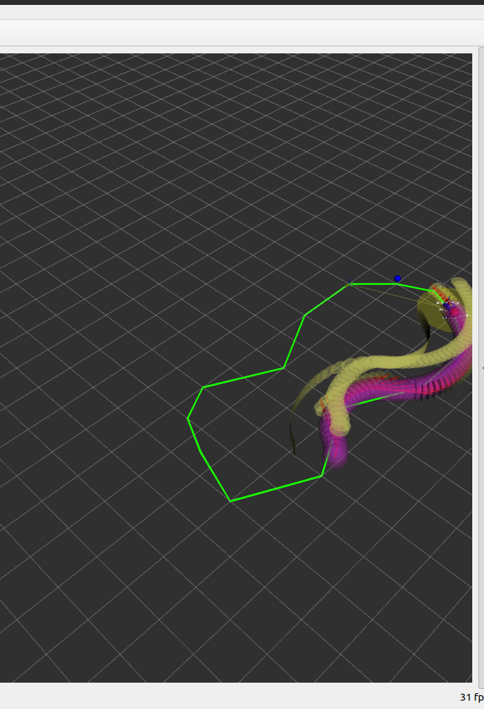

# Pure Pursuit Algorithm

Here is my implementations of the Pure Pursuit algorithm in Python . The Pure Pursuit algorithm is a path tracking algorithm used in robotics and autonomous vehicles to follow a predefined path.
It calculates the steering angle required to follow a path based on the current position and orientation of the vehicle.

## Features
* Simple Pure Pursuit:
    - Implements the basic Pure Pursuit algorithm.
    - Fixed Lookahead distance.
* Adaptive Pure Pursuit(without controller):
    - Implements the Pure Pursuit algorithm with adaptive lookahead distance.
    - In this version , the lookahead distance is adjusted so as to minimize the latreal error.
    - This is done by calculating the area enclosed by the path and the vehicle's trajectory.

    